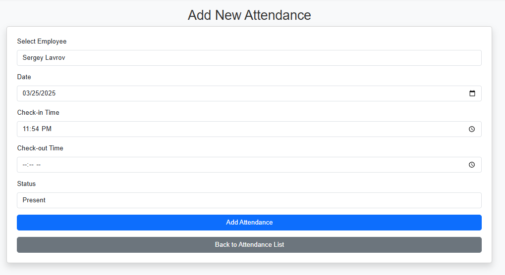
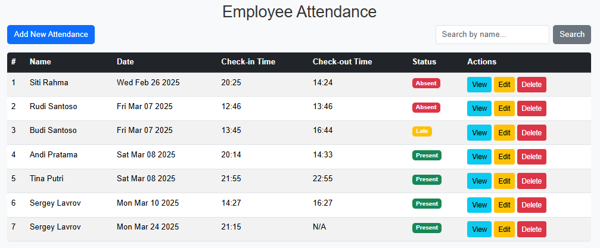

---
# 💼 Employee Management System

A full-stack web application designed to manage employee data and attendance seamlessly. Built with **Node.js, Express.js, EJS, and MongoDB**, this system allows admins to handle user authentication, attendance tracking, employee records, and reporting — all in one clean dashboard interface.
---

## 🌟 Highlights

- 🔐 **Secure Authentication** (Passport.js + Sessions)
- 📋 **Attendance CRUD System** (Check-In, Check-Out, Status)
- 👥 **Employee Management** with detailed profiles
- 🧠 **Validation & Feedback** using Joi + Flash Messages
- 🎨 **Responsive UI** with Bootstrap + EJS

---

## 🚀 Tech Stack

| Layer       | Technology                          |
|-------------|-------------------------------------|
| Backend     | Node.js, Express.js                 |
| Frontend    | EJS, EJS-Mate, Bootstrap            |
| Database    | MongoDB with Mongoose               |
| Auth        | Passport.js, Passport-Local-Mongoose|
| Validation  | Joi                                 |
| Uploads     | Multer                              |
| Session     | express-session, connect-flash      |

---

## 🛠️ Installation & Setup

### 1. Clone the repository
```bash
git clone https://github.com/RaidanRR/employee-management.git
cd employee-management
```

### 2. Install dependencies
```bash
npm install
```

### 3. Create `.env` file
```
DATABASE_URL=mongodb://127.0.0.1/employee-attendance
SECRET=yourSecretKey
```

### 4. (Optional) Seed sample data
```bash
node seeds/employee.js
node seeds/attendance.js
```

### 5. Run the development server
```bash
nodemon app.js
```

Visit the app at `http://localhost:3000`

---

## 🗂️ Folder Structure
```
├── app.js                 # Entry Point
├── models/                # Mongoose Schemas
├── routes/                # Express Routers
├── views/                 # EJS Templates
├── public/                # Static Assets
├── seeds/                 # Seed Scripts
├── .env                   # Environment Variables
└── package.json           # Project Metadata
```

---

## 📸 Preview

> **Admin Dashboard**
> - Manage Employees & Attendance  
> - View status (Present, Absent, Late)  
> - Clean Bootstrap layout  
> 

### ➕ Add Attendance Form


### 📊 Attendance Table



---

## 🤝 Collaboration

Open to contributions, feedback, and collaboration.  
If you're a recruiter or tech lead, feel free to explore the code and see how I work.  
If you're a developer, feel free to fork, enhance, and scale it.

---

## 📄 License

Licensed under the [MIT License](LICENSE)

---

### 👋 Let’s Connect  
This project is part of my personal full-stack journey and self-branding initiative: **Reltroner Studio**  
Feel free to reach out via email or [GitHub discussions](https://github.com/RaidanRR/employee-management/discussions)

---

